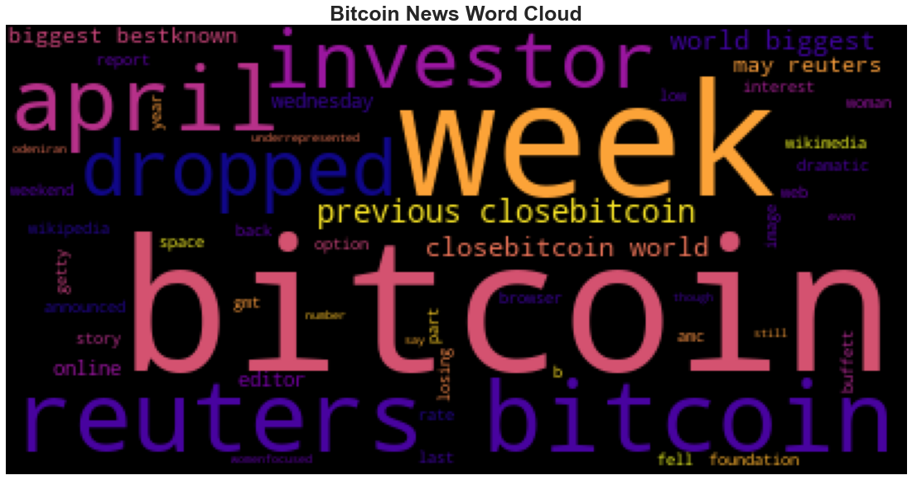
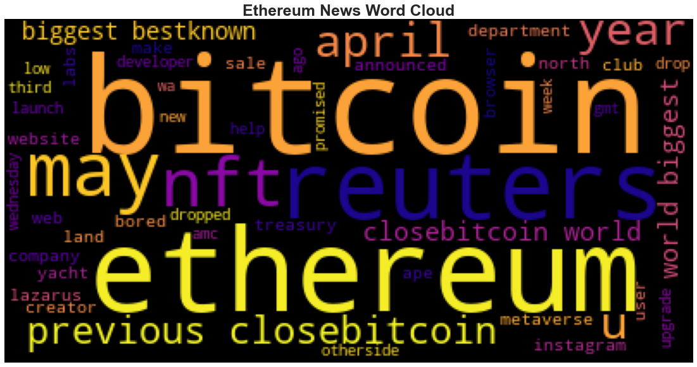

# BTC and ETH Sentiment Analysis

Applying natural language processing to understand the sentiment in the latest news articles featuring Bitcoin and Ethereum.

In this project, we use the Natural Language ToolKit library to analyze the sentiment of news around Bitcoin and Ethereum, and also build word clouds as helpful visualizations.

We use spaCy to build a Named Entity Recognizer (NER) model to identify non-overlapping labelled spans of tokens. This model adds context to an otherwise non-interpreted string through categorization of key pieces of information within the text.

News articles are obtained using [newsapi](https://newsapi.org/).

### Sentiment Analysis Results

1. Bitcoin had the highest mean positive score at `0.066750`

2. Bitcoin had the highest compound score at `0.750600`

3. Bitcoin had the highest positive score at `0.202000`

### Word Clouds

These word clouds display the most prevalent words that occur in articles about each cryptocurrency.

#### Bitcoin Word Cloud

#### Ethereum Word Cloud

## Conclusion

This analysis showcases how context can be gathered from simple text using advanced NLP libraries.